     

# Projects Made using Vanilla JavaScript
This repo contains all basic and frontend projects I made using vanilla javascript, html and CSS, while learning javascript.
I made a lot of projects to enhance my javascript skills.
## Projects
<ol>
<li>
<a href="snake-water-gun">Snake Water Gun Game</a>
 
<a href="https://tush-tr.github.io/vanilla-js-projects/snake-water-gun/">- Check live</a>
</li>
<li>
<a href="customer-reviews">Store customer reviews - storing entered data on the screen</a> 
<a href="https://tush-tr.github.io/vanilla-js-projects/customer-reviews/">- Check live</a>
</li>
<li>
<a href="dice-simulator">Dice Simulator</a> 
<a href="https://tush-tr.github.io/vanilla-js-projects/dice-simulator">- Check live</a>
</li>
<li>
<a href="letter-counter">Letter Counter</a> 
<a href="https://tush-tr.github.io/vanilla-js-projects/letter-counter">- Check live</a>
</li>
<li>
<a href="random-quote-generator">Random Quote Generator - generate a random quote after every 5 seconds</a> 
<a href="https://tush-tr.github.io/vanilla-js-projects/random-quote-generator">- Check live</a>
</li>
<li>
<a href="dice-game">The Dice Game- simulates random dice number for two players</a> 
<a href="https://tush-tr.github.io/vanilla-js-projects/dice-game">- Check live</a>
</li>
<li>
<a href="coin_toss">Toss the coin -toss the coin randomly</a> 
<a href="https://tush-tr.github.io/vanilla-js-projects/coin_toss/">- Check live</a>
</li>
<li>
<a href="analog_clock">Analog Clock</a> 
<a href="https://tush-tr.github.io/vanilla-js-projects/analog_clock/">- Check live</a>
</li>
<li>
<a href="healthifier">Healthifier- Calculate your bmr and tdee</a> 
<a href="https://tush-tr.github.io/vanilla-js-projects/healthifier">- Check live</a>
</li>
<li>
<a href="typing-speed-tester">Typing Speed Tester</a> 
<a href="https://tush-tr.github.io/vanilla-js-projects/typing-speed-tester/">- Check live</a>
</li>
<li>
<a href="calculator_js">Calculator</a> 
<a href="https://tush-tr.github.io/vanilla-js-projects/calculator_js">- Check live</a>
</li>
<li>
<a href="love-calculator">Love Calculator</a> 
<a href="https://tush-tr.github.io/vanilla-js-projects/love-calculator">- Check live</a>
</li>
<li>
<a href="drum-pad">Drum Pad</a> 
<a href="https://tush-tr.github.io/vanilla-js-projects/drum-pad">- Check live</a>
</li>
<li>
<a href="note-your-words">Note your words</a>
 
<a href="https://tush-tr.github.io/vanilla-js-projects/note-your-words">- Check live</a>
</li>
<li>
<a href="table-maker">Table generator</a>
 
<a href="https://tush-tr.github.io/vanilla-js-projects/table-maker">- Check live</a>
</li>
</li>
<li>
<a href="ascii-finder">ASCII Value Finder</a>
 
<a href="https://tush-tr.github.io/vanilla-js-projects/ascii-finder">- Check live</a>
</li>
<li>
<a href="show-me-jokes">Show me joke</a>
 
<a href="https://tush-tr.github.io/vanilla-js-projects/show-me-jokes">- Check live</a>
</li>
<li>
<a href="dog-images">Search Dog Images</a>
 
<a href="https://tush-tr.github.io/vanilla-js-projects/dog-images">- Check live</a>
</li>
<li>
<a href="weather-app">Weather App</a>
 
<a href="https://tush-tr.github.io/vanilla-js-projects/weather-app">- Check live</a>
</li>

<li>
<a href="github-profile-app">Github Profile app</a>
 
<a href="https://tush-tr.github.io/vanilla-js-projects/github-profile-app">- Check live</a>
</li>

<li>
<a href="guess-the-number">Guess the number</a>
 
<a href="https://tush-tr.github.io/vanilla-js-projects/guess-the-number">- Check live</a>
</li>

<li>
<a href="share-secrets">Secret message sharing app</a>
 
<a href="https://tush-tr.github.io/vanilla-js-projects/share-secrets">- Check live</a>
</li>
</ol>

<h1 align="center">Preview of projects</h1>

## <a href="snake-water-gun">Snake Water Gun Game</a>
<a href="https://tush-tr.github.io/vanilla-js-projects/snake-water-gun/">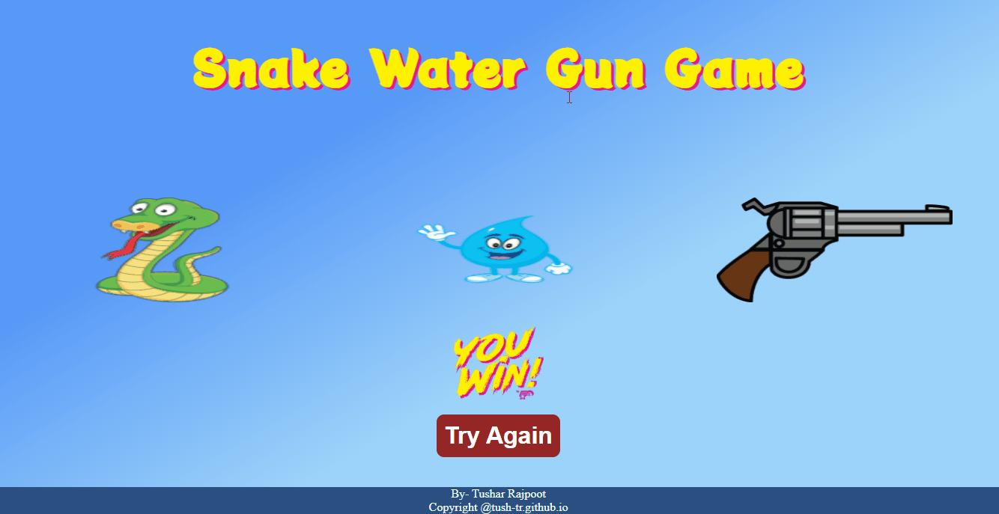</a><a href="https://tush-tr.github.io/vanilla-js-projects/snake-water-gun/">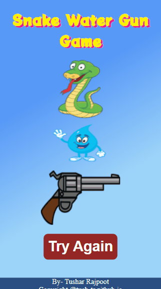</a>

## <a href="analog_clock">Analog Clock</a>
<a href="https://tush-tr.github.io/vanilla-js-projects/analog_clock/">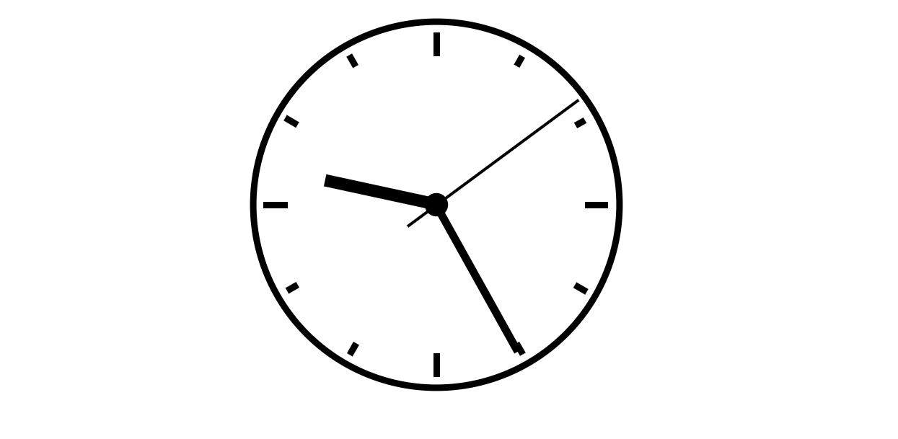</a>

## <a href="healthifier">Healthifier</a>
<a href="https://tush-tr.github.io/vanilla-js-projects/healthifier/">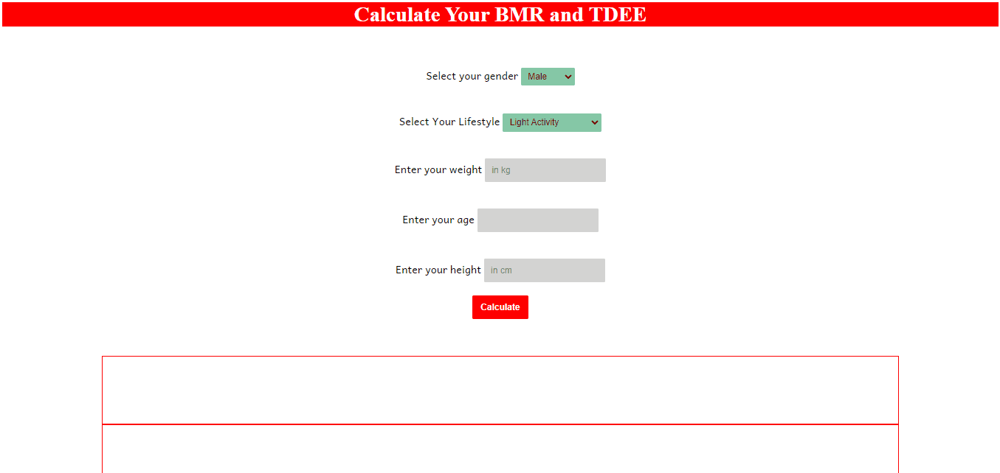</a>

## <a href="coin_toss">Toss the coin</a>
<a href="https://tush-tr.github.io/vanilla-js-projects/coin_toss/">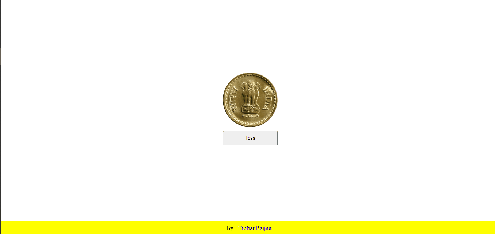</a>

## <a href="typing-speed-tester">Typing Speed Tester</a>
<a href="https://tush-tr.github.io/vanilla-js-projects/typing-speed-tester/">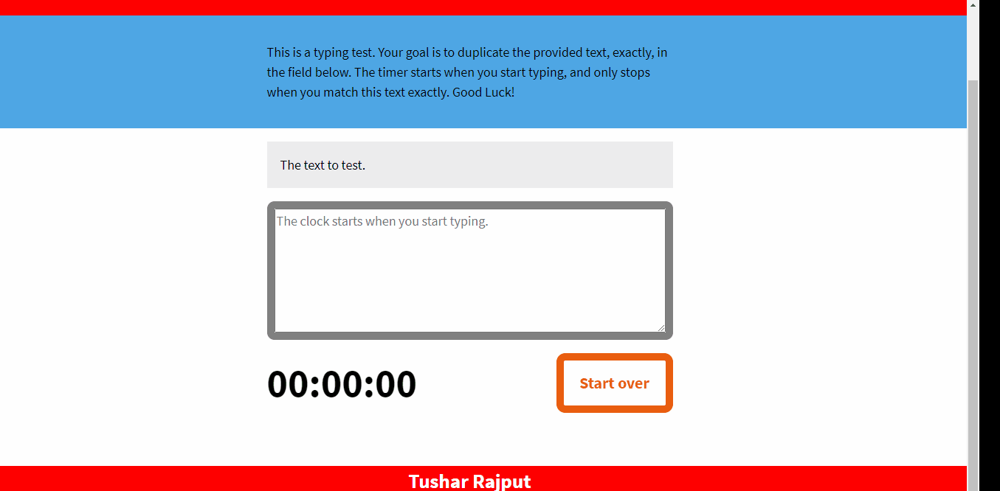</a>

## <a href="calculator_js">Calculator</a>
<a href="https://tush-tr.github.io/vanilla-js-projects/calculator_js/">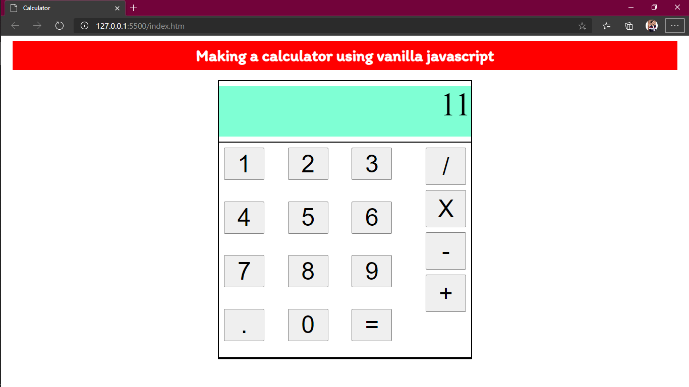</a>

## <a href="letter-counter">Letter Counter</a>

## <a href="customer-reviews">Customer Reviews Store</a>
<a href="https://tush-tr.github.io/vanilla-js-projects/customer-reviews/">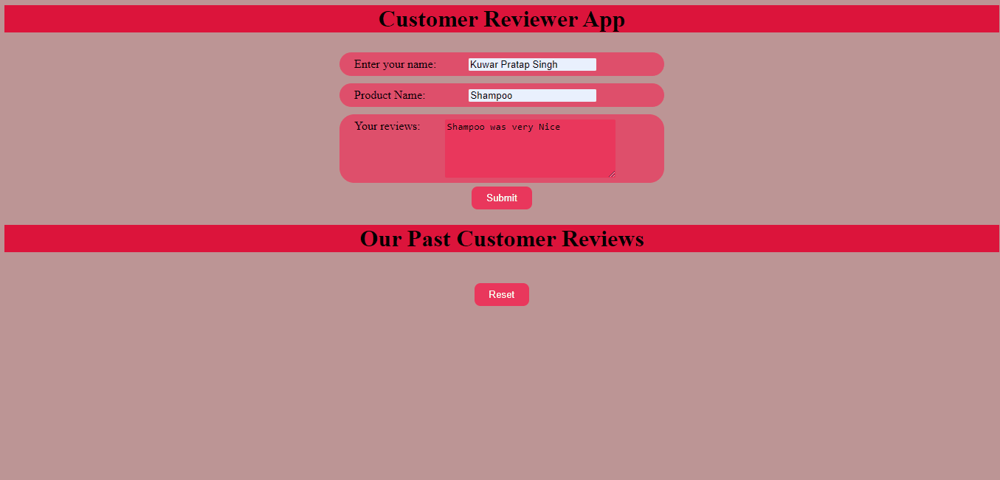</a>

## <a href="dice-simulator">Dice Simulator</a>
<a href="https://tush-tr.github.io/vanilla-js-projects/dice-simulator/">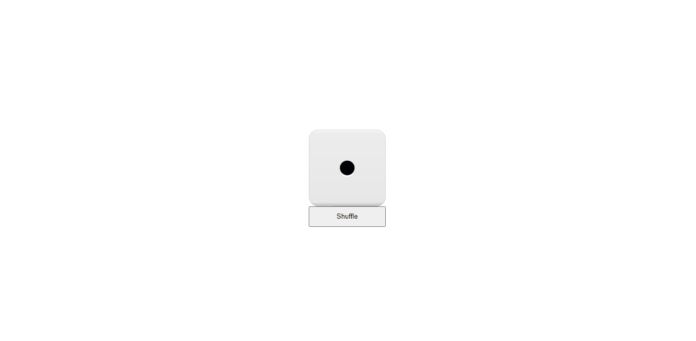</a>

## <a href="random-quote-generator">Random Quote Generator</a>
<a href="https://tush-tr.github.io/vanilla-js-projects/customer-reviews/">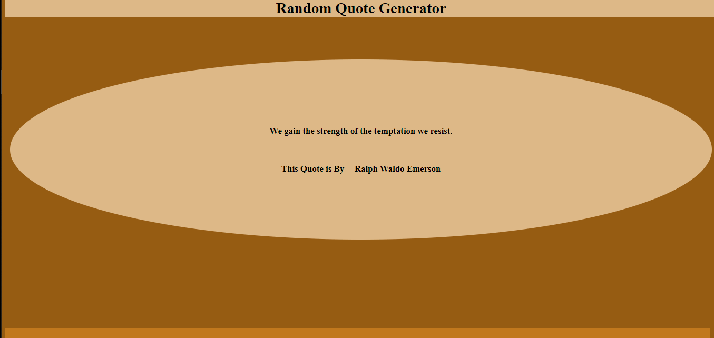</a>

## <a href="dice-game">The Dice Game</a>

## <a href="drum-pad">The Drum pad</a>
<a href="https://tush-tr.github.io/vanilla-js-projects/drum-pad/">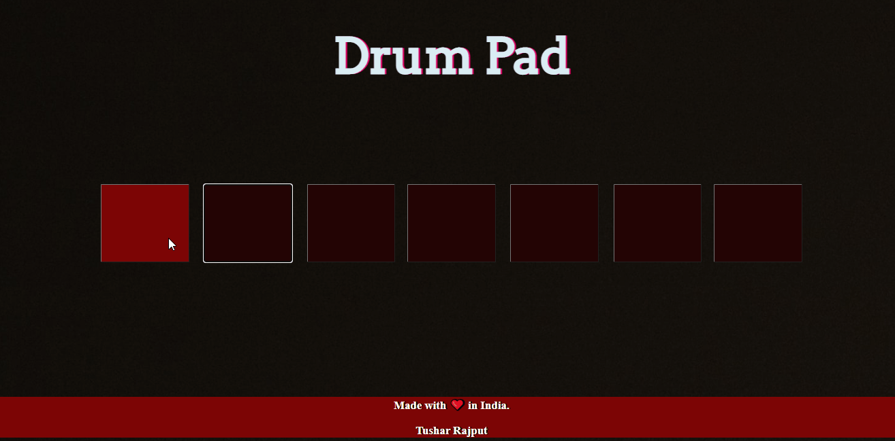</a>

## <a href="note-your-words">Note your words</a>
<a href="https://tush-tr.github.io/vanilla-js-projects/note-your-words/">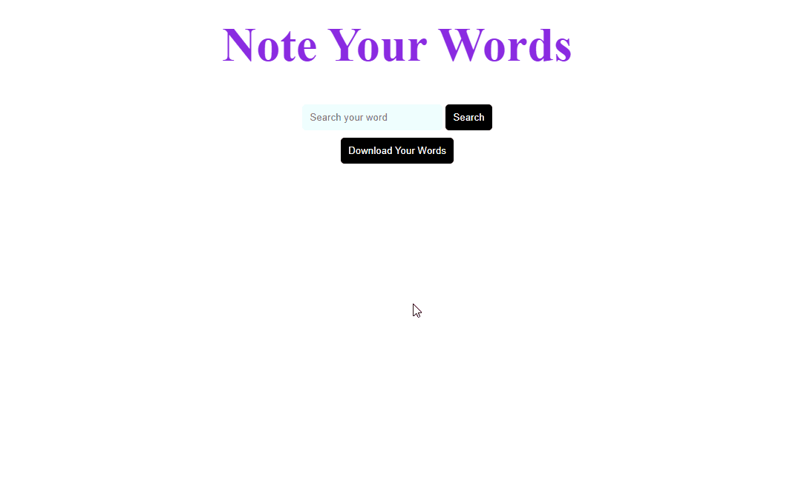</a>

## <a href="table-maker">Table Generator</a>

## <a href="ascii-finder">ASCII Value Finder</a>
<a href="https://tush-tr.github.io/vanilla-js-projects/ascii-finder/">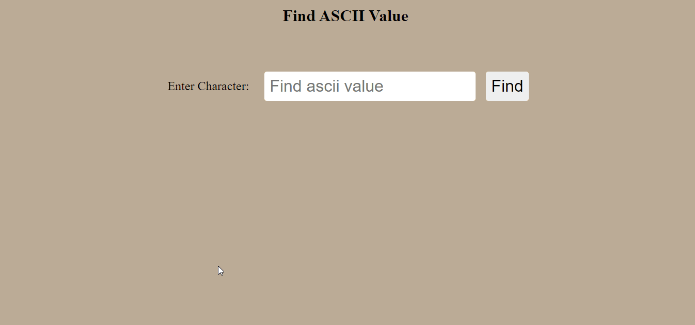</a>

## <a href="show-me-jokes">Show me Joke</a>
<a href="https://tush-tr.github.io/vanilla-js-projects/show-me-jokes/">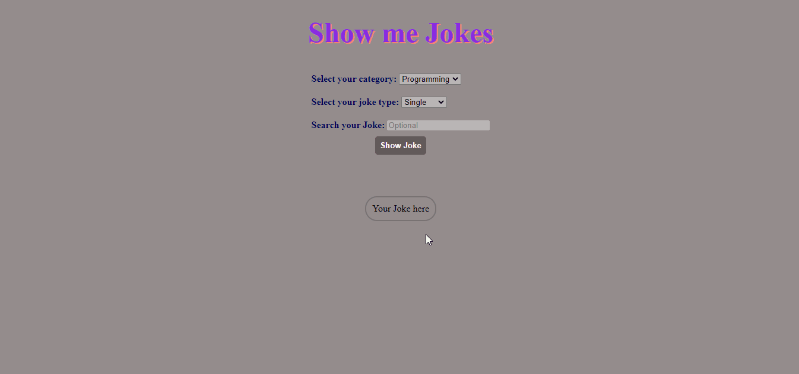</a>

## <a href="dog-images">Search Dog Images</a>

## <a href="weather-app">Weather App</a>
<a href="https://tush-tr.github.io/vanilla-js-projects/weather-app/">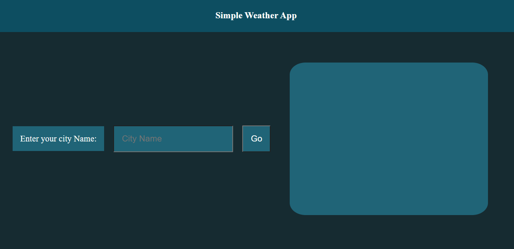</a>

## <a href="github-profile-app">Github Profile App</a>
<a href="https://tush-tr.github.io/vanilla-js-projects/github-profile-app/">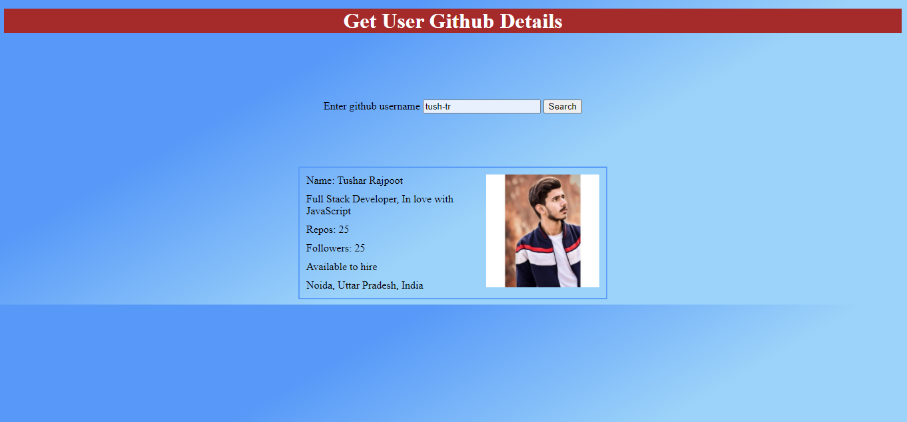</a>

## <a href="guess-the-number">Guess the number</a>
<a href="https://tush-tr.github.io/vanilla-js-projects/guess-the-number/">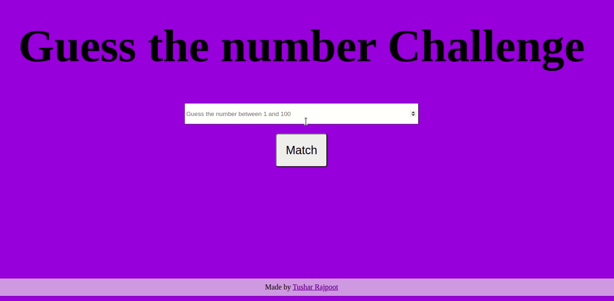</a>

<link rel="stylesheet" href="https://use.fontawesome.com/releases/v5.15.1/css/all.css" integrity="sha384-vp86vTRFVJgpjF9jiIGPEEqYqlDwgyBgEF109VFjmqGmIY/Y4HV4d3Gp2irVfcrp" crossorigin="anonymous">

<a href="http://tush-tr.github.io">@tush-tr.github.io</a>
<a href="http://github.com/tush-tr" class="nav-link"><i class="fab fa-github"></i></a>
<a href="https://www.linkedin.com/in/tushar-r-849510116/" class="nav-link"><i class="fab fa-linkedin"></i></a>
<a href="https://twitter.com/tush_tr604" class="nav-link"><i class="fab fa-twitter"></i></a>

